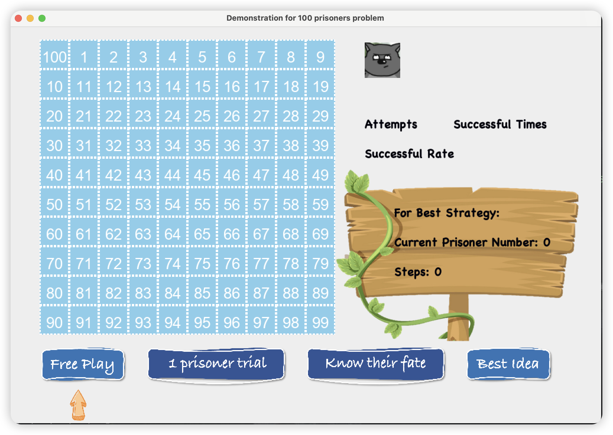
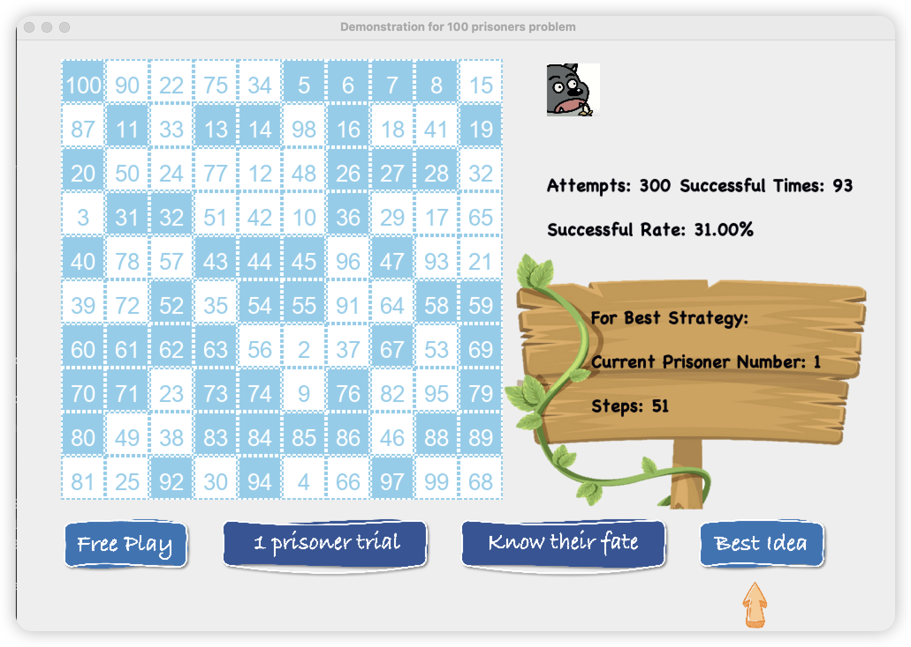

A Java GUI demo to play and test strategies for [100 prisoner problems](https://en.wikipedia.org/wiki/100_prisoners_problem).

Applied double buffering to eliminate the flicker effect and utilized recursion to simulate repeated Bernoulli trials.

To start the game, simply run GameGo.java, you will get into this interface

Click `Free Play`, you can play as one of the prisoners and test your strategy.

This video elaborates on the problem and introduces the best strategy for this problem:

https://www.youtube.com/watch?v=iSNsgj1OCLA&t=50s

Click `1 prisoner trial`, you can get the result of the first prisoner following the best strategy.

Click `know their fate`, you can test the best strategy with all 100 prisoners and get their outcome.

Click `Best Idea`, you can test the best strategy for 300 rounds to test the probability

